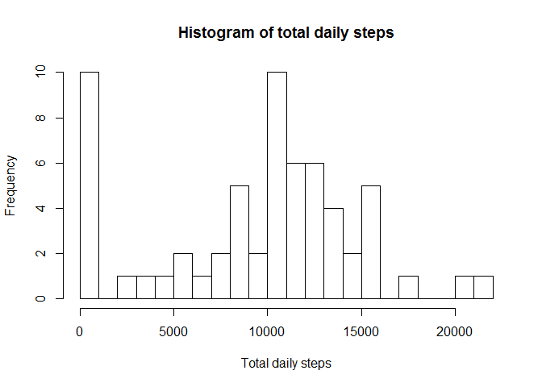
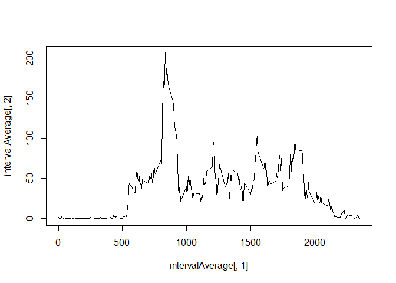
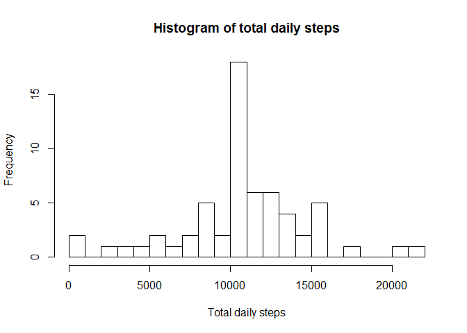
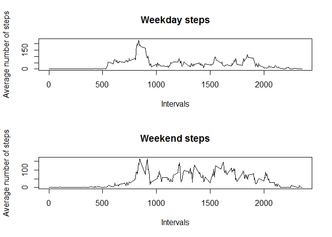

# Course project 1

1. Code for reading in the dataset  


```r
activity <- read.csv(file = "activity/activity.csv");
```

2. Histogram of the total number of steps taken each day, and  
3. Mean and medium number of steps taken each day  


```r
dailySteps <- aggregate(activity$steps,by=list(activity$date),FUN=sum, na.rm=TRUE)
summary(dailySteps[,2])
```

```
##    Min. 1st Qu.  Median    Mean 3rd Qu.    Max. 
##       0    6778   10395    9354   12811   21194
```

```r
hist(dailySteps[,2],breaks=30, main="Histogram of total daily steps",xlab = "Total daily steps")
```

<!-- -->

4. Time series plot of the average number of steps taken, and  
5. The 5-minute interval that, on average, contains the most number of steps


```r
intervalAverage <- aggregate(activity$steps,by=list(activity$interval),FUN=mean, na.rm=TRUE)
plot(intervalAverage[,1],intervalAverage[,2],type="l")
```

<!-- -->

```r
intervalAverage[which.max(intervalAverage[,2]),1]
```

```
## [1] 835
```


6. Code to describe and show a stragey for the inputing the missing values. NA values are replaced by the average number of steps taken in that interval, this is executed by looping through all 'steps' entries, and replacing NA entries with the intervalAverage value which matches the 'interval' associated with the NA entry.    
7. Histogram of the total number of steps per dat after missing values are imputed. Compared to the histogram taken before the NA values were replaced, this graphic shows  less days with zero steps recorded (previously only NA entries), mainly shifting to the average number of total daily steps.  


```r
stepsCleaned<-activity$steps
for (i in 1:length(activity$steps))
{
        if(is.na(activity$steps[i]))
        {
           stepsCleaned[i]<-intervalAverage[which(intervalAverage[,1]==activity$interval[i]),2]
        }
}
activityCleaned<-data.frame(stepsCleaned,activity$date,activity$interval)
dailyStepsCleaned <- aggregate(activityCleaned$stepsCleaned,by=list(activityCleaned$activity.date),FUN=sum, na.rm=TRUE)
summary(dailyStepsCleaned[,2])
```

```
##    Min. 1st Qu.  Median    Mean 3rd Qu.    Max. 
##      41    9819   10766   10766   12811   21194
```

```r
hist(dailyStepsCleaned[,2],breaks=30, main="Histogram of total daily steps",xlab = "Total daily steps")
```

<!-- -->

8. Panel plot comparing the average number of steps taken per 5-minute intervals across weekdays and weekends   


```r
activityCleaned$d<- as.factor(ifelse(weekdays(as.Date(activityCleaned$activity.date),abbreviate=TRUE) %in% c("Sat", "Sun"), "wknd","wkdy"))
intervalAverageWkdys <- aggregate(activityCleaned$stepsCleaned[which(activityCleaned$d=="wkdy")],by=list(activityCleaned$activity.interval[which(activityCleaned$d=="wkdy")]),FUN=mean)
intervalAverageWknds <- aggregate(activityCleaned$stepsCleaned[which(activityCleaned$d=="wknd")],by=list(activityCleaned$activity.interval[which(activityCleaned$d=="wknd")]),FUN=mean)
par(mfcol=c(2,1))
plot(intervalAverageWkdys[,1],intervalAverageWkdys[,2],type="l",main="Weekday steps", xlab = "Intervals", ylab="Average number of steps")
plot(intervalAverageWknds[,1],intervalAverageWknds[,2],type="l", main='Weekend steps', xlab = "Intervals", ylab="Average number of steps")
```

<!-- -->
